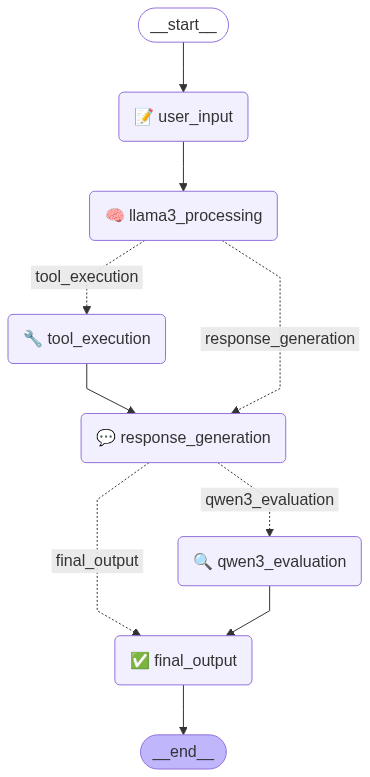
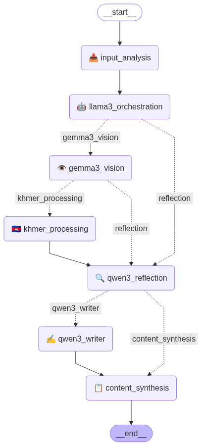

# LangChain Tools Agents Collection

This directory contains multiple AI agents built with LangChain, LangGraph, and Ollama for different use cases. Each agent showcases different capabilities and architectures.

## 🤖 Available Agents

### 1. Modern Tool Agent (`langchain_tool_agent.py`)
**Primary Model**: Llama3.1 + Qwen3 Evaluator
**Architecture**: Single model with evaluation feedback loop

**Features**:
- **Tool Orchestration**: Llama3.1 manages all tool calling and coordination
- **Built-in Tools**: Weather, calculator, jokes, time, password generator, fun facts
- **Safety Evaluation**: Qwen3:8b evaluates responses for serious topics (medical, legal, financial)
- **Memory Management**: LangGraph checkpointer for conversation history
- **Workflow Visualization**: Auto-generates workflow diagrams

**Key Capabilities**:
- Natural conversational interface with tool integration
- Real-time safety evaluation for sensitive topics
- Streaming responses with tool execution feedback
- Quality assessment and content flagging

**Example Use Cases**:
```
• "What's the weather in Tokyo?"
• "Calculate 25 * 4 + sqrt(16)"
• "Generate a 15 character password"
• "What should I do if I have chest pain?" (triggers Qwen3 evaluation)
```

### 2. Multi-Model Content Agent (`scraper_content_agent.py`)
**Primary Models**: Llama3.1 + Gemma3 + Qwen3
**Architecture**: Multi-model orchestration with specialized roles

**Model Roles**:
- **Llama3.1**: Tool orchestration and workflow coordination
- **Gemma3**: Vision-only image analysis (no tool calling)
- **Qwen3**: Content writing and quality reflection

**Features**:
- **Web Scraping**: Extract clean text from websites
- **Image Processing**: OCR and vision analysis with Gemma3
- **Khmer Support**: Specialized Khmer text detection and processing
- **Content Generation**: Comprehensive writing in multiple formats
- **Quality Reflection**: Qwen3 evaluates extraction quality

**Tools Available**:
- `scrape_website()` - Extract clean text from URLs
- `extract_links_from_page()` - Get all links from webpages
- `extract_images_from_page()` - Extract image URLs
- `analyze_image_with_gemma3()` - Vision analysis using Gemma3
- `extract_text_from_image()` - OCR with Khmer + English support
- `detect_khmer_text()` - Khmer script detection and analysis
- `summarize_content()` - Smart content summarization
- `evaluate_extraction_quality()` - Quality metrics assessment
- `write_comprehensive_content()` - Professional content creation

**Content Types & Styles**:
```
Content Types: news, report, article, blog, academic, summary
Writing Styles: professional, casual, academic, journalistic, creative
```

**Example Use Cases**:
```
• "Scrape https://example.com and write a news article about it"
• "Extract content and create a professional report"
• "Analyze this image and write a detailed blog post"
• "Process Khmer content and write a bilingual report"
```

## 🔧 Setup & Configuration

### Environment Variables
Both agents use environment variables for security:

```bash
# .env file
LLM_API_BASE_URL=http://your-ollama-server:11434
```

### Required Models
```bash
# Install required Ollama models
ollama pull llama3.1:latest    # Tool orchestration
ollama pull gemma3:27b         # Vision analysis (content agent only)
ollama pull qwen3:8b           # Writing and evaluation
```

### Python Dependencies
```bash
pip install langchain-ollama langgraph python-dotenv
pip install requests beautifulsoup4 pillow pytesseract  # For content agent
```

## 🎯 Architecture Comparison

| Feature | Modern Tool Agent | Multi-Model Content Agent |
|---------|------------------|---------------------------|
| **Primary Use** | General assistance with tools | Content extraction & writing |
| **Models** | Llama3.1 + Qwen3 | Llama3.1 + Gemma3 + Qwen3 |
| **Tool Calling** | Llama3.1 only | Llama3.1 only |
| **Vision Support** | None | Gemma3 vision analysis |
| **Language Support** | English | English + Khmer |
| **Content Creation** | Basic | Comprehensive writing |
| **Workflow** | Simple feedback loop | Complex multi-stage pipeline |

## 🔄 Workflow Diagrams

Both agents automatically generate workflow diagrams:

### Modern Tool Agent Workflow


### Multi-Model Content Agent Workflow  


The diagrams show the complete execution flow including:
- Input processing and analysis
- Tool orchestration by Llama3.1
- Model-specific processing (Gemma3 vision, Qwen3 writing/evaluation)
- Quality reflection and feedback loops
- Final output synthesis

## 🚀 Usage

### Modern Tool Agent
```python
from langchain_tool_agent import ModernToolAgent

agent = ModernToolAgent()
response = agent.chat("What's 2+2 and tell me a joke?")
```

### Multi-Model Content Agent
```python
from scraper_content_agent import ScrapeContentAgent

agent = ScrapeContentAgent()
result = agent.process_content("Scrape https://news.site.com and write a report")
```
